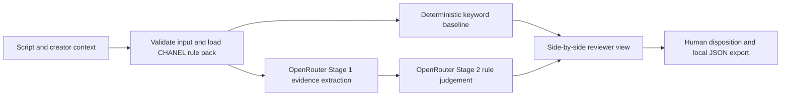

# Creator Content Review Workbench

A human-in-the-loop review tool for sponsored creator scripts. It puts a fast, explainable keyword baseline beside an AI-assisted review, surfaces quoted evidence and uncertainty, and leaves the final disposition with a reviewer.

This is an independent, local prototype based on CHANEL's publicly available [Social Media Guidelines](https://www.chanel.com/us/makeup/social-media-guidelines/). It is not affiliated with or approved by CHANEL and does not represent a brand's private campaign brief.

**Policy scope:** this version supports the CHANEL rule set only. Its findings and evaluation results must not be applied to another brand. A brand without a reviewed policy pack is unsupported; the system must not silently reuse CHANEL rules or return `PASS` for that brand. See the [policy-pack architecture](docs/policy_pack_architecture.md).

## The review workflow

1. Add caption, spoken copy, planned on-screen text, brand context, and whether the creator has first-hand product experience.
2. Run the free keyword baseline to catch literal signals.
3. Optionally request an AI-assisted review to examine context and evidence. The interface shows a cost estimate and asks for confirmation first.
4. Compare verdicts, quoted evidence, rule IDs, and rationales. Ambiguous cases can be escalated.
5. A person records the final disposition and can download a local JSON review record containing the script, policy source, both available checks, evidence, decision, and timestamps. The model does not approve content.

The prototype currently focuses on sponsorship disclosure, sponsor identity, disclosure placement represented in structured text fields, and potentially misleading competitor criticism. No private campaign brief has been supplied, so mandatory selling points are explicitly **not evaluated**; a `PASS` covers only the supported public-guideline checks.

## Product in one view

**Primary user:** a brand-content reviewer checking tomorrow's creator draft before publication. This is a design persona, not an interviewed user. **Input:** English caption, planned spoken/on-screen lines, sponsorship context, and known or unknown first-hand product use. **Output:** two proposed verdicts, rule-linked quoted evidence, uncertainty, and a downloadable final human decision. A `PASS` applies only to the text and public rules checked here.



The keyword path is free and offline. The AI path is optional, paid, and gated by a cost preview. See the [product and architecture guide](docs/product_overview.md) for component ownership, exact inputs and outputs, metrics targeted versus reached, and limits.

## Try the workbench

Python 3.9 or later is required. The app uses the Python standard library; no package installation is needed.

```powershell
python -m src.web_app
```

Open `http://127.0.0.1:8765`. The saved example and keyword review work offline without an API call. Drafts and reviewer decisions remain in this browser session unless the reviewer explicitly downloads the JSON record; nothing is stored on the server. A live AI review sends two requests to OpenRouter and may incur a charge; it requires an API key and explicit confirmation. Never place a key in a project file or commit it.

For a no-call command-line review and its cost preflight:

```powershell
python -m src.review_one examples/review_case.json
```

To run the model, review the printed estimate and use `--run-api --confirm-paid-run`. The single-script tool enforces a US$0.10 ceiling and does not overwrite existing result files. See [AI request and cost design](docs/ai_api_design.md).

## Evaluation snapshot

A separate [public-content feasibility pilot](reports/real_public_reels_pilot_v1.md) links to **10 real CHANEL-related creator Reels** from nine creators and records only directly observable caption signals. It found nine CHANEL-specific partnership markers and one generic `#gifted` marker with brand tags in the visible captions. Video/audio disclosures and creator-use facts were not verified, so the pilot reports **no full policy labels and no model accuracy**. These posts are not mixed into the fictional development sets.

The primary balanced 30-case synthetic set scored **27/30 (90.0%)** for the revised AI reviewer and **24/30 (80.0%)** for the measured keyword baseline. A separate 30-case synthetic extension scored **23/30 (76.7%)** for AI and **20/30 (66.7%)** for the baseline. Keep the splits separate; the extension is supplementary development evidence, not a real-world benchmark.

The examples are fictional, and the prompt was revised after an earlier run. A later 11-case blind review and [rule-by-rule adjudication](reports/boundary_case_adjudication_v1.md) identified four proposed overall label changes and one additional rule ID. The scores above still use the original frozen labels; no revised score is claimed. The [sensitivity analysis](reports/label_adjudication_sensitivity_v1.md) shows exactly how retrospective relabeling would change the saved scores and why that is not an independent benchmark. These small-sample results describe the constructed cases and do not establish real-world performance or prove that AI is generally better. See the [evaluation report](reports/holdout_keyword_baseline_results.md), [data guide](data/README.md), and [evaluation protocol](docs/evaluation_redesign_protocol.md).

No numeric performance target was registered before these runs. The [product guide](docs/product_overview.md#metrics-targeted-and-reached) separates observed results from **prospective targets** for a new, independently labelled test; it does not retroactively call the current scores a pass. The [evaluation guide](reports/README.md) maps each reported number to its saved data and output file.

On the extension run, estimated token cost was **US$0.00792 per script** and observed two-call latency was **10.72 seconds median** (30 saved cases). The workbench shows these historical figures, the live preflight cost ceiling, and each available result's measured cost and latency. Pricing is a dated estimate, not a provider invoice; observed latency is not a service guarantee.

## Product boundaries

- Text-only: it cannot verify actual video visibility, spoken audibility, or timing.
- No team accounts, persistent review history, configurable ruleset editor, or campaign-platform integration.
- No live-video, audio, image, multimodal, or real-time moderation.
- The rules cover a narrow interpretation of public guidance; they do not establish legal compliance or private campaign requirements.
- Other brands are not configured or supported in this version; a separate source-grounded, versioned rule pack and its own evaluation set are required.
- Local demo only; it has not been security-reviewed for multi-user use.

## Run checks

```powershell
python -m unittest discover -s tests -v
python -m src.evaluate_baseline data/extension_cases_v2.jsonl
python scripts/label_sensitivity.py
```

## Project notes

- [Product positioning and interview narrative](docs/portfolio_positioning.md)
- [Product scope](scope.md) and [design decisions](decisions.md)
- [Product persona, inputs, outputs, architecture and metrics](docs/product_overview.md)
- [Evaluation files and metric definitions](reports/README.md)
- [Source assessment](docs/brand_source_research.md)
- [Evaluation protocol](docs/evaluation_redesign_protocol.md) — separates the primary 30-case result from the supplementary extension.

