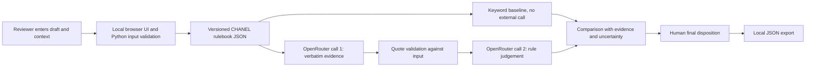

# Product overview and system architecture

## User and decision

**Design persona, not an interviewed user:** Mei is a creator-partnership reviewer checking an English sponsored-video draft before tomorrow's scheduled post. She knows the campaign relationship and can ask the creator for evidence, but does not need to understand model prompts or token pricing. Today she may search for disclosure words and read the full script herself. In this workbench she compares a free literal check with a source-linked AI proposal, then decides whether to approve the in-scope copy, request a change, or escalate it. The project has not measured how much time this saves Mei or any real reviewer.

The current policy pack is a project interpretation of selected [public CHANEL Social Media Guidelines](https://www.chanel.com/us/makeup/social-media-guidelines/). Project rule IDs are not official CHANEL IDs. This is an independent text-review prototype, not CHANEL approval, legal clearance, or a multi-brand checker. A private campaign brief has not been supplied, so mandatory selling points are **not evaluated**. Other brands require their own reviewed source, rule pack, and test set.

## Inputs and outputs

| Surface | Actual prototype contract |
|---|---|
| Input | One English draft: caption lines, scenes with spoken and on-screen text, sponsored-brand context, and metadata including whether first-hand product use is known, false, or unknown. The sample schema is in [`examples/review_case.json`](../examples/review_case.json). |
| Free output | Deterministic keyword verdict with rule-linked findings. It catches literal signals and has no API cost. |
| Optional paid output | Stage 1 extracts verbatim signals and locations. Stage 2 applies four project rules and returns `PASS`, `FLAG`, or `HUMAN_REVIEW`, with findings and reasons. The interface also shows the cost preview, saved estimated usage cost, and elapsed time. |
| Human handoff | The reviewer records a final disposition and downloads a JSON record with the draft, rule source, available method outputs, evidence, decision, and timestamps. The browser does not create server-side history. |

`PASS` means no issue was found within these supported text checks. The system cannot establish whether disclosure is audible, visible, or on screen long enough in a finished video. A person must inspect the final asset.

## Implemented architecture

The project owns the browser interface (`web/`), local service (`src/web_app.py`), validation (`src/validate_data.py`), keyword method (`src/baseline.py`), source-to-rule mapping (`data/rulebook.json`), orchestration (`src/ai_reviewer.py`), and evaluation (`src/evaluate_baseline.py`, `src/evaluate_ai.py`). It rents `openai/gpt-6-sol` through OpenRouter for the two AI stages. The rulebook is short, so it is sent in the decision instructions; no retrieval index or model fine-tuning is used. The saved example and baseline work without a key. A live AI run needs an API key in the local environment, a cost preflight, and explicit confirmation.

The split between evidence extraction and judgement makes evidence inspectable but costs two calls and adds latency. A one-call variant was not measured, so the split's incremental benefit is unknown. This is a design trade-off rather than a demonstrated gain.

## Metrics targeted and reached

**Historical evaluation:** Neither the primary nor extension run had pre-registered numeric success thresholds. The table therefore reports observations, not a claim that preset targets were met. Both splits have ten cases per gold class; results are against their original frozen labels. The primary prompt was revised after inspecting its earlier outputs. The extension held that revised prompt fixed, but remained project-authored synthetic data.

| Measure | Primary AI / keyword | Extension AI / keyword | Interpretation |
|---|---:|---:|---|
| Three-class correct verdicts | 27/30 / 24/30 | 23/30 / 20/30 | One-label guessing would score 10/30 on either balanced split. |
| Clear violations correctly `FLAG`ged | 10/10 / 10/10 | 10/10 / 9/10 | A violation marked `PASS` is a false negative; extension keyword missed one. |
| Clean cases incorrectly `FLAG`ged | 0/10 / 0/10 | 0/10 / 2/10 | Human escalation is counted separately from a false `FLAG`. |
| Borderline cases sent to `HUMAN_REVIEW` | 9/10 / 5/10 | 5/10 / 3/10 | The extension AI over-decided five borderline cases. |
| Valid structured AI outputs | 30/30 / n.a. | 30/30 / n.a. | This measures format, not decision correctness. |
| AI token cost estimate per script | US$0.00713 / US$0 | US$0.00792 / US$0 | API-reported tokens × dated standard rates; not a bill. |
| Median two-call wait | 9.72 s / local | 10.72 s / local | Observed on saved runs; not a service guarantee. |

**Prospective targets for a new independently labelled test:** flag at least 90% of clear violations, falsely flag at most 10% of clean scripts, and send at least 70% of genuinely borderline scripts to a person. These thresholds were chosen **after** the runs above and cannot be used to declare those runs successful. They should be frozen with a new permissioned dataset and prompt before testing. On the existing extension, the first two would be satisfied and borderline escalation would fall short at 5/10. The next study should also time reviewer decisions and corrections; current business impact is unmeasured.

See [`data/README.md`](../data/README.md) for case provenance and labels, [`reports/README.md`](../reports/README.md) for run files and metric definitions, and [`docs/policy_pack_architecture.md`](policy_pack_architecture.md) for the unbuilt multi-brand direction.
